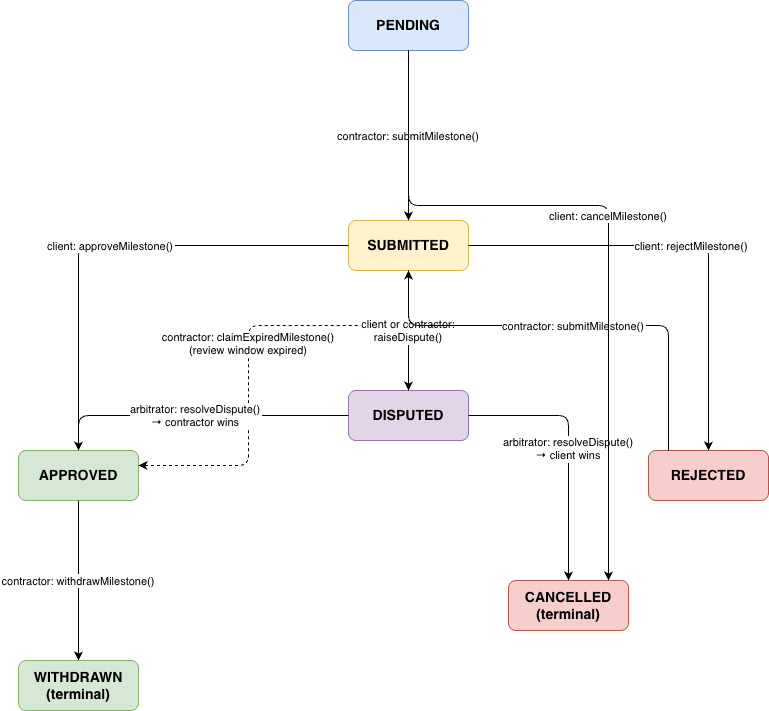

# Milestone Escrow

A Solidity smart contract implementing a milestone-based escrow system 
for freelance and contract work. Built for the Kula take-home assignment.

---

## Architecture & Design Decisions

### Contract Structure
```
contracts/
├── MilestoneEscrow.sol       # Core escrow logic
├── interfaces/
│   └── IEscrow.sol           # Public interface, enums, events, errors
└── mocks/
    └── MockERC20.sol         # ERC20 token for testing
```

The system is designed around a single `MilestoneEscrow` contract that manages 
multiple escrow agreements identified by incrementing IDs. Each escrow contains 
an array of milestones that move through a defined state machine.

### State Machine

Each milestone moves through the following states:



**States:**
- `PENDING` — created, awaiting contractor submission
- `SUBMITTED` — contractor submitted, awaiting client review
- `APPROVED` — client approved or review window expired
- `REJECTED` — client rejected, contractor may resubmit
- `DISPUTED` — dispute raised, payout paused until arbitrator resolves
- `WITHDRAWN` — funds claimed by contractor *(terminal)*
- `CANCELLED` — cancelled by client, funds refunded *(terminal)*

### Key Design Decisions

**1. Separation of createEscrow and fundEscrow**  
Creation and funding are two separate transactions. This allows the client 
to review the agreement before committing funds, and gives the contractor 
time to confirm terms before the client locks funds.

**2. Pull-based withdrawals**  
Funds are not automatically pushed to the contractor on approval. The 
contractor must explicitly call `withdrawMilestone()`. This avoids gas 
issues with automatic transfers and gives the system a clean separation 
between approval state and fund movement.

**3. Review window expiry protects the contractor**  
If a client goes silent after submission, the contractor can call 
`claimExpiredMilestone()` after the review window passes. This auto-approves 
the milestone and allows withdrawal. Without this, a client could ghost and 
permanently lock contractor funds.

**4. CEI pattern enforced on all fund movements**  
All functions that transfer tokens follow Checks-Effects-Interactions strictly:
state is updated before any external token call. Combined with OpenZeppelin's 
`ReentrancyGuard`, this provides two layers of reentrancy protection.

**5. SafeERC20 for all token transfers**  
Raw `transfer()` and `transferFrom()` calls are never used. `SafeERC20` 
handles non-standard tokens that do not return a boolean (e.g. USDT), 
preventing silent transfer failures.

**6. escrowId starts at 1**  
escrowId 0 is intentionally never assigned. Since Solidity mappings return 
zero-value structs for non-existent keys, starting at 1 makes it trivial 
to distinguish a valid escrow from an uninitialized mapping lookup.

**7. Disputes are per-milestone, not per-escrow**  
Each milestone can be independently disputed and resolved. This allows 
a project to continue progressing on other milestones while one is under 
dispute, rather than freezing the entire escrow.

**8. Optional arbitrator**  
The arbitrator address is set at escrow creation and can be `address(0)` 
if neither party wants arbitration. Calling `raiseDispute()` on an escrow 
without an arbitrator reverts; ensuring disputes can only be raised when 
there is a resolution path available.

---

## Assumptions

- The payment token is a standard ERC-20. Fee-on-transfer tokens and 
  rebasing tokens are not supported.
- Milestone amounts are fixed at escrow creation and cannot be modified 
  after funding.
- The arbitrator is a trusted third party agreed upon by both parties 
  at contract creation. No on-chain arbitrator selection mechanism is provided.
- The client funds the full escrow amount upfront. Partial funding is 
  not supported.
- A single milestone can only have one active dispute at a time.
- Off-chain communication (e.g. milestone descriptions, dispute reasons) 
  is handled outside the contract. Only state transitions are managed on-chain.

---

## Tradeoffs & Limitations

| Area | Decision | Tradeoff |
|------|----------|----------|
| Upgradeability | Not implemented | Simpler and more trustless, but bugs require redeployment |
| Arbitration | Single arbitrator address | Simple to implement, but centralized trust assumption |
| Milestone descriptions | Stored off-chain | Saves gas, but requires off-chain coordination |
| Native ETH | Not supported | Reduces complexity, ERC-20 only |
| Factory pattern | Not implemented | Each escrow deployed separately, no cross-escrow discovery |
| Partial payouts | Not supported | Milestones are all-or-nothing |

---

## How to Run the Tests

### Prerequisites

- Node.js v18 or v20
- pnpm

### Install dependencies
```bash
pnpm install
```

### Compile contracts
```bash
npx hardhat compile
```

### Run test suite
```bash
npx hardhat test
```

### Run with gas report
```bash
REPORT_GAS=true npx hardhat test
```

### Expected output
```
MilestoneEscrow
    createEscrow
      ✔ should create escrow with correct parameters
      ✔ should start escrow counter at 1
      ✔ should revert with zero address contractor
      ✔ should revert with zero address payment token
      ✔ should revert with empty milestone amounts
      ✔ should revert if contractor is same as client
      ✔ should revert with zero review window
    fundEscrow
      ✔ should fund escrow and transfer tokens
      ✔ should revert if already funded
      ✔ should revert if not client
    submitMilestone
      ✔ should submit a pending milestone
      ✔ should revert if not contractor
      ✔ should revert if milestone already submitted
      ✔ should revert with invalid milestone index
      ✔ should allow resubmission after rejection
    approveMilestone
      ✔ should approve a submitted milestone
      ✔ should revert if not client
      ✔ should revert if review window expired
    rejectMilestone
      ✔ should reject a submitted milestone
      ✔ should revert if review window expired
    claimExpiredMilestone
      ✔ should auto-approve after review window expires
      ✔ should revert if review window not yet expired
      ✔ should revert if not contractor
    withdrawMilestone
      ✔ should transfer funds to contractor on withdrawal
      ✔ should revert if milestone not approved
      ✔ should revert on double withdrawal
      ✔ should revert if not contractor
    cancelMilestone
      ✔ should refund client on cancel
      ✔ should revert if milestone already submitted
      ✔ should revert if not client
    raiseDispute
      ✔ should allow client to raise dispute on submitted milestone
      ✔ should allow contractor to raise dispute
      ✔ should revert if no arbitrator set
      ✔ should revert if milestone not submitted
      ✔ should revert if stranger raises dispute
    resolveDispute
      ✔ should resolve in favor of contractor — approve for withdrawal
      ✔ should resolve in favor of client — refund immediately
      ✔ should revert if not arbitrator
      ✔ should revert if not disputed
      ✔ should revert if resolvedFor is not client or contractor
    Full flow
      ✔ should complete a full 3-milestone project lifecycle
    ...

  41 passing
```

---

## Security Considerations

- **Reentrancy**: All state-changing functions that transfer tokens use 
  `nonReentrant` modifier and follow CEI pattern
- **Access control**: Every function validates `msg.sender` against 
  stored client/contractor/arbitrator addresses using custom errors
- **Integer overflow**: Solidity 0.8.x built-in overflow protection
- **Zero address checks**: Validated on all critical address inputs
- **Double withdrawal prevention**: `WITHDRAWN` is a terminal state — 
  once set, no further withdrawals are possible
